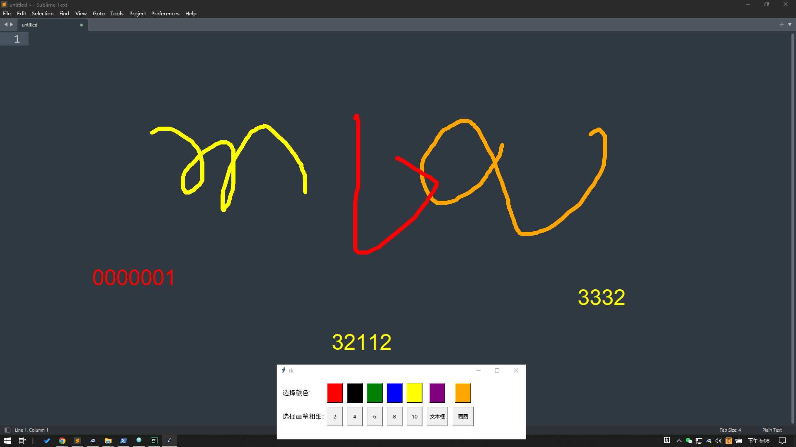

# DrawingApp - 屏幕绘图应用


DrawingApp 是一个基于 `Tkinter` 构建的 Python GUI 应用程序，允许您直接在屏幕上绘图。它提供绘图工具、文本输入功能以及屏幕图像捕捉，非常适合实时标注屏幕或在演示期间使用。

## 功能
- **快捷键支持**：使用自定义快捷键轻松切换绘图模式并保存您的工作。
- **屏幕捕捉**：将您的标注屏幕保存为 PNG 图像。
- **屏幕绘图**：在屏幕上自由绘图，可调整画笔粗细和颜色。
- **文本输入**：在屏幕上任意位置添加编辑的文本。
- **画笔配置**：从多种颜色和粗细中选择画笔，定制绘图体验。

## 安装

### 先决条件
- Python 3.x
- 以下库：
  - `Tkinter`（Python 自带）
  - `Pillow`（用于屏幕捕捉）
  - `keyboard`（用于全局快捷键）

### 安装所需依赖项
```bash
pip install Pillow keyboard
```

### 克隆仓库
```bash
git clone https://github.com/your-username/drawing-app.git
cd drawing-app
```

## 使用方法

### 运行应用程序
运行 `main.py` 脚本来启动 DrawingApp：

```bash
python main.py
```

### 快捷键
- `F1`：启动绘图模式。
- `F2`：保存当前屏幕图像并清空画布。
- `Esc`：保存当前屏幕图像。按两次 `Esc` 保存并退出应用程序。

### 模式
- **绘图模式**：允许在屏幕上自由绘制。
- **文本模式**：可以在屏幕上任意位置插入编辑的文本。

## 工作原理

### 应用程序主流程
1. **绘图窗口**：主绘图窗口是一个全屏的 `Tkinter` 画布，将屏幕捕捉为背景，您可以在上面绘制、添加文本并将画布捕捉为图像。
2. **颜色和画笔选择窗口**：一个辅助窗口用于选择画笔颜色、调整画笔宽度，并在绘图和文本模式之间切换。
3. **全局快捷键**：通过全局快捷键（F1、F2 和 Esc）控制绘图操作、保存和退出功能。

## 自定义
您可以通过编辑 `create_color_buttons()` 和 `create_pen_width_buttons()` 方法轻松修改可用的颜色和画笔宽度。也可以在 `bind_hotkeys()` 方法中添加新的快捷键或操作。

## 许可证
此项目使用 MIT 许可证。